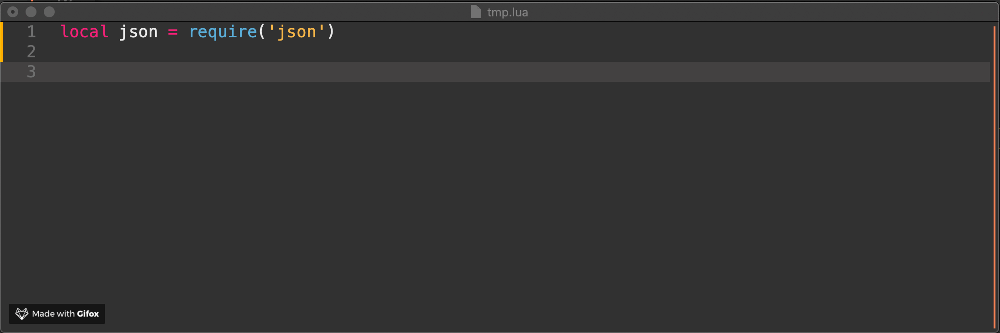

# tarantool-lsp
[](https://travis-ci.org/artur-barsegyan/tarantool-lsp)

A [Language Server][lsp] for Tarantool/Lua code, written in Lua.

[lsp]: https://github.com/Microsoft/language-server-protocol

It's still a work in progress, but it's usable for day-to-day. It currently
supports:

## [lua-lsp legacy][lua-lsp]

[lua-lsp]: https://github.com/Alloyed/lua-lsp

* Limited autocompletion
* Goto definition
* As you type linting and syntax checking
* Code formatting
* Supports Lua 5.1-5.3 and Luajit

## Tarantool specific
* Support autocompletion for Tarantool built-in libs on the fly

  

* Support hovering for Tarantool built-in libs on the fly

  

* Enhance completion support
  - [NEW] Completions triggered only on `require`

* Impl CLI doc manager

  * parsing Tarantool documentation
  * version management
  * manual updates

* Powered by Tarantool

### Installation/Usage

tarantool-lsp can be installed using `brew`:
```
$ brew install https://github.com/artur-barsegyan/tarantool-lsp/raw/master/tarantoollsp.rb --HEAD
```
This will install the `tarantool-lsp`.

If you want to enable Tarantool documentation for the server, do the next command:

```
$ tarantool-lsp docs init
```

To update the documentation you need to run the next command:

```
$ tarantool-lsp docs update
```

After this, you should configure your text editor. Language clients can then communicate with this process using stdio as a transport. See [editors.md](editors.md) for more instructions specific to your editor of choice.

### Plugins

tarantool-lsp automatically integrates with common lua packages, when they are
installed. For linting, install luacheck:
```
$ luarocks install luacheck
```
For code formatting, we currently support Formatter and LCF. Formatter is 5.1
only, whereas lcf is 5.3 only.
5.1:
```
$ luarocks-5.1 install Formatter
$ luarocks-5.3 install lcf
```
If you have another package you'd like to see integrated, feel free to leave an
issue/PR. Other plugins are always welcome, especially if they provide
materially different results.

### Configuration

tarantool-lsp reads a few project-level configuration files to do its work.

To configure linting, we read your standard [.luacheckrc][check] file.

For autocomplete support, we reimplement the [.luacompleterc][complete] format
created by atom-autocomplete-lua. In particular, we need `luaVersion` to
properly understand your code.

More LSP-specific configuration flags will hopefully be provided through your
editor's configuration support.

[complete]: https://github.com/dapetcu21/atom-autocomplete-lua#configuration
[check]: http://luacheck.readthedocs.io/en/stable/config.html

### TODO

The LSP spec is big, and we don't implement all of it. here's a
quick wishlist ordered by roughly by priority/feasibility.

* List references (`textDocument/references`)
* Find symbols (`workspace/symbol`)
* Function signature help (`textDocument/signatureHelp`)
* Code links (`textDocument/documentLink`)
* File events (`workspace/didChangeWatchedFiles`)
